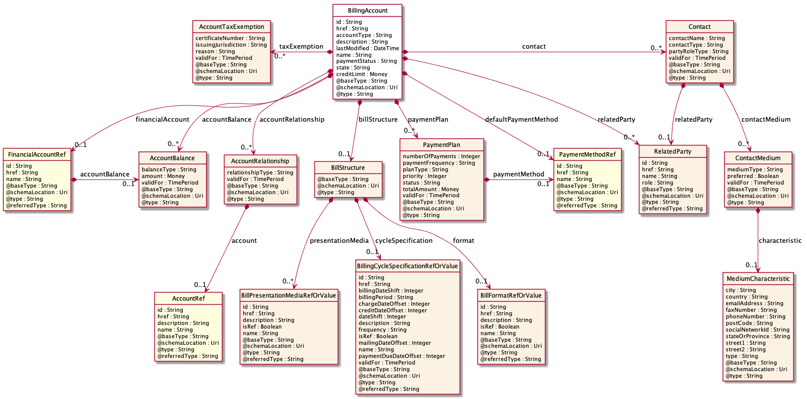
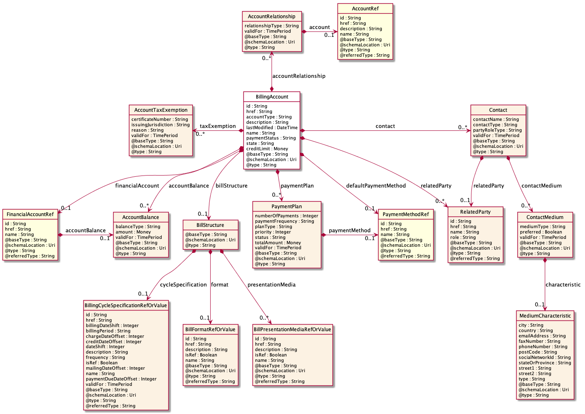
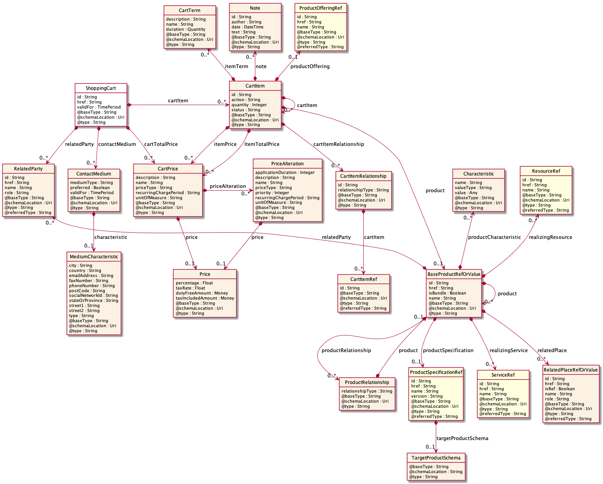
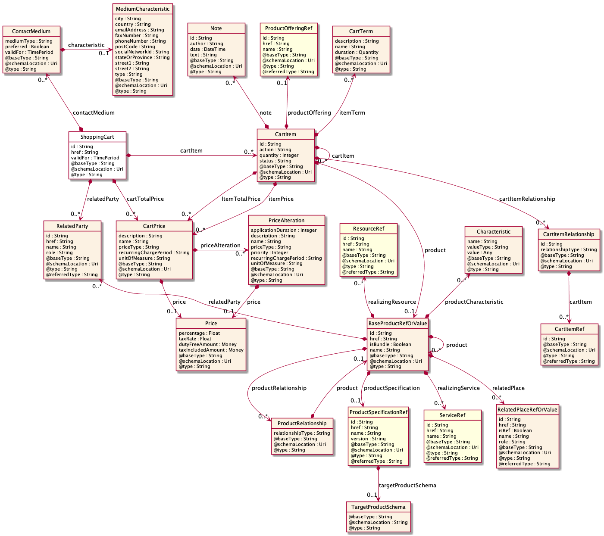
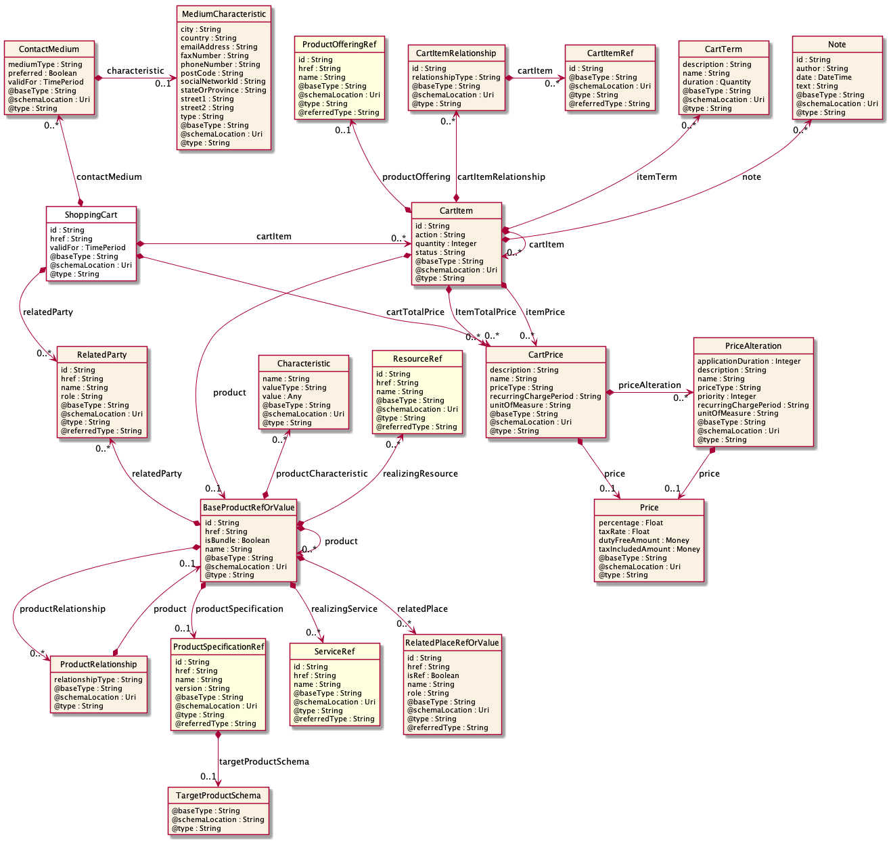

# Instructions for generating API diagrams locally

## Pre-requisites

1.	Graphviz is used by Plantuml and must be available.

On Windows, follow the instructions found here: https://graphviz.gitlab.io/_pages/Download/Download_windows.html 

On Linux and Mac, follow the instructions found here: https://graphviz.gitlab.io/download/ 

2.	Java must be installed locally

On Windows, Mac and Linux, follow the instructions found here: #TODO

## Running

`
java -jar apidiagram.jar --openapi<api>
`

This will generate one Plantuml (.puml) file for each resource in the api. 

Create diagrams running the Plantuml app like this

` 
java -Djava.awt.headless=true -jar plantuml.jar Resource_nn.puml
` 

Plantuml will be default generate diagrams in PNG format. Use the ` -t`  argument to select desired format, e.g. SVG.

Like this

`
java -Djava.awt.headless=true -jar plantuml.jar Resource_nn.puml -tsvg
` 

Try

`java -jar apidiagram.jar help` 

for overview of arguments and the configuration file.

### Arguments
  -c, --config

  Config files (.json) or .yaml) - one or more

  --explicit-document-details
  
  Use explicit document details (specified using the --config option) 

  --floating-enums
  
  Floating enums - do not place enums close to the referring resource 

  --generated-target-directory
  
  Directory for generated results. Default is the target directory
 
  --highlight-required
  
  Highlight required properties and relationships (default false)
 
  --include-description
  
  Include description in class diagrams (default false)

  --include-orphan-enums
  
  Include all enums not linked to any specific resource

  --include-puml-comments
  
  Add comments in .puml file

  --layout
  
  Layout configuration settings

  --orphan-enum-config
  
  Include / show orphan enums for the list of identified resources

  --resource
  
  Specific resource to process (default is all)
    
  --show-all-cardinality
  
  Include cardinality details for all properties (including default cardinality) 

  --silent
  
  Do not include progress messages (default false)

  -s, --source
  
  Include source details in footer (0=no, 1=basic, >1 include filename) 

  -f, --file, --swagger, --openapi

  Input OpenAPI file (or optionally as default argument)

  --target-directory
  
  Target directory for output. Default is the current directory

  --working-directory
  
  Working directory, default is the current directory

## Manual layout

The automatic layout can in some cases be improved. 

Use the `--layout` option to specify the location of the configuration file.

### Example 1 - Account
The default BillingAccount layout may look like this



The layout is possibly too wide to print nicely when included in a document. The layout can be guided by the layout configuration settings.
As an example, the following configuration places `AccountRelationship` above the `BillingAccount`

```json
{
   "BillingAccount": {
      "placeAbove": [ "AccountRelationship" ] 
   }

}
```
The diagram now looks like this:


To further balance the layout, we place two more resouces on top:
```json
{
   "BillingAccount": {
	  "placeAbove": [ 
		  "AccountRelationship", 
		  "PaymentPlan", 
		  "PaymentMethodRef" 
		] 
   }

}
```
The final layout is as follows:


### Example 2 - ShoppingCart

The default ShoppingCart layout may look like this



The layout is not too bad, but we would like to improve. One attempt is to place the `ContactMedium` above the `ShoppingCart`. 
```json
{
   "ShoppingCart": {
      "placeAbove":["ContactMedium"],
      "placeRight": ["CartItem"] 
   }
}
```
The automatic layout tries to place `Item` resources to the right of the containing resource, but in this case `CartItem` is not matching. For that reason, we also place the `CartItem` to the right. 

The diagram now looks like this:


To further balance the layout, we place the `CartItemRelationship` also above the `CartItem`:
```json
{
   "ShoppingCart": {
      "placeAbove":["ContactMedium"],
      "placeRight": ["CartItem"] 
   },
   "CartItem": {
      "placeAbove": ["CartItemRelationship"]
   }

}
```
The layout is now like this:


The two nodes above the `BaseProductRefOrValue` seems is creating some "noise" in the diagram. It may be better to also place these below. 
In the configuration file, we now have to specify *four* nodes to place below. If not, the automatic layout will still try to place the other two above. Further, the top row is possibly a bit wide and we move the `ContactMedium` to the left of the `ShoppingCart`. 

The complete configuration file is now like this: 
```json
{
   "ShoppingCart": {
      "placeLeft":["ContactMedium"],
      "placeRight": ["CartItem"] 
   },

   "CartItem": {
      "placeAbove": ["CartItemRelationship"]
   },

   "BaseProductRefOrValue": {
	  "placeBelow": [
		  "Characteristic", 
		  "ResourceRef", 
		  "ServiceRef", 
		  "RelatedPlaceRefOrValue"]
   },

   "ContactMedium": {
      "placeBelow": ["MediumCharacteristic"]
   } 


}
```
The final layout is as follows:

